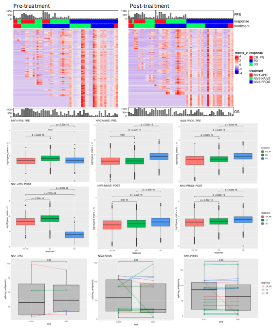
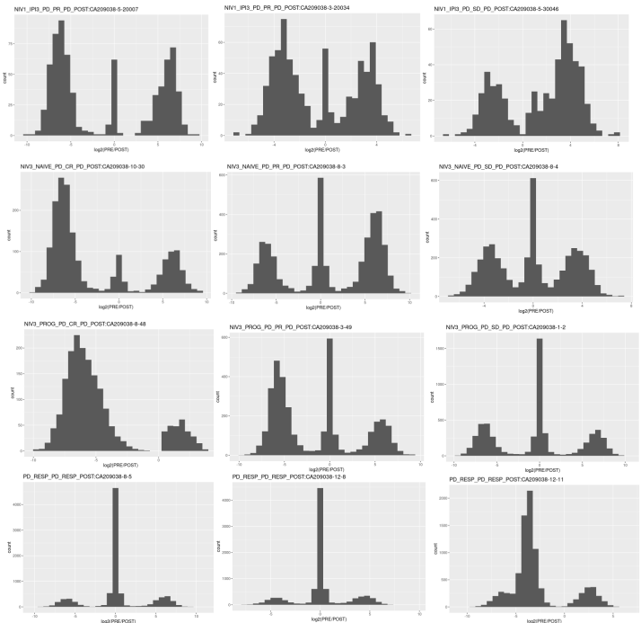
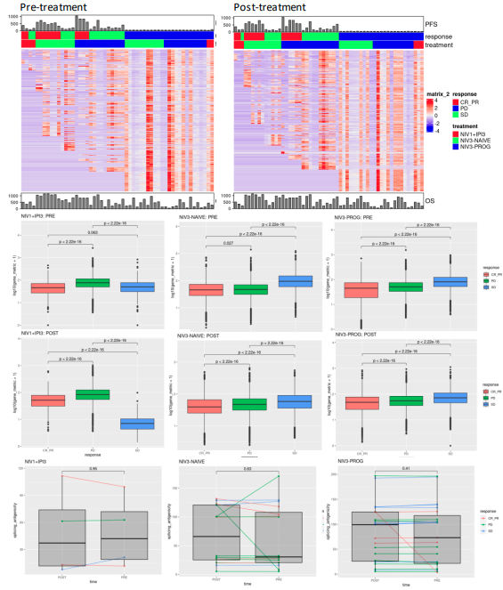
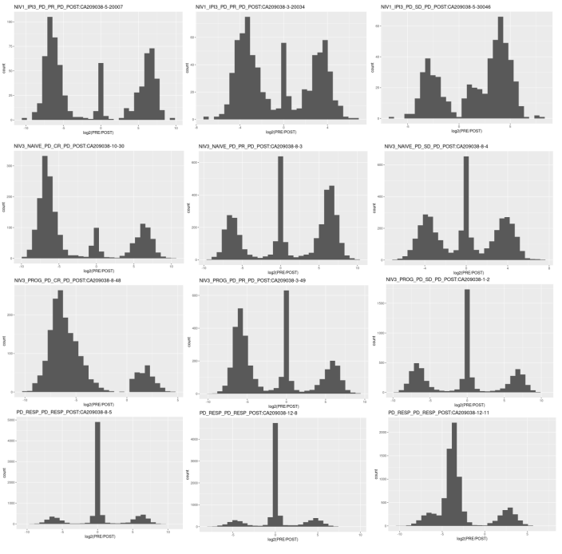

# Introduction

# Methods

## The Splicemutr Pipeline

|   In developing spicemutr, my goal was to develop a method for evaluating the role alternative splicing plays in tumor development under the limitation of non-ideal, yet highly used experimental methods. The non-ideal, yet highly used experimental methods I am talking about are short-read RNA-sequencing methods. Although capable of producing high-throughput sequencing libraries of the target transcriptome under analysis, short-read RNAseq outputs typically make inaccurate assemblies of novel mRNA molecules. With the exception of RNAseq libraries that ensure whole molecule mRNA capture of coverage, these innacuracies are the standard. 

|   Yet, statistical methods have been developed to aid in the analysis of alternative splicing from a purely intronic perspective. These methods leverage the fact that, even with low coverage of mRNA molecules, RNA-seq split reads mapping to pairs of exons can be used to identify introns that have been spliced out. An intron is evidenced by proof of an upstream exon being spliced together by a downstream exon via RNA-seq split reads. So an intron can be classified in RNA-seq by its pair of flanking exons as well as its splice site coordinates, ie the exact coordinates of the flanking exons joined together. The more RNA-seq split reads that map to the same flanking exons as well as the same splice site coordinates within these RNA-seq split reads, the more evidence for a specific intron being spliced out. Further, many genes are capable of producing functionally different mRNA products through alternative splicing, whereas individual introns within groups of overlapping introns in a gene model are selected to be spliced out based on functional need, environmental pressure, and splicing dysregulation. Intron usage can be quantified within these groups of mutually exclusive introns using RNA-seq split-read counts. This is the basis of many tools such as LeafCutter, LeafCutterMD, RMATS, and SEVA.

|   After intron usage quantification between biological comparators, comparator-specific introns can be identified and validated through biological validation and/or further in-silico methods. Biological validation entails designing molecular biology experiments that can test for specific sequence composition of the joined splice site in your samples of interest. Still, biological validation requires identification of the flanking exons associated with the intron of interest, identification of the transcripts likely to be associated with the flanking exons, and the design of sequencing probes that can be used to identify the existence of the mRNA product in your sample of interest. Much of this process is painstakingly done by eye by an experienced biologist. In developing the splicemutr toolset, I sought to automate this process as well as open the door to the evaluation of the per-intron functional impact of alternative splicing selection, similar to how mutational signatures are evaluated in disease. 

|   At it's basic level, the splicemutr toolset takes as input a set of introns in BED file format, their chromosome location, and splice site coordinates. Per intron, splicemutr identifies whether the intron has a pair of splice sites that are found spliced together in the associated reference transcriptome. If so, the intron is classified as an annotated intron and is classified as an unannotated intron if not. Next, splicemutr identifies the pair of flanking exons associated with each splice site for the intron. Using each individual flanking exon, the upstream flanking transcripts are selected if they contain the upstream flanking exon and the downstream flanking transcripts are selected if they contain the downstream flanking exons. All combinations of a single upstream transcript and a single downstream transcript are formed. In the case of an intron that is classified as annotated, only matching flanking transcripts are preserved within the transcript combinations. Additionally, since the intron is annotated, the flanking exons should be directly spliced together within the transcript. If this is not the case, the matching flanking transcript pair is not preserved. In the case of the unannotated introns, all transcript pairings are preserved unless it is determined that there is a subset of matching transcript pairings that contain directly adjacent flanking exons. In this case, only those matching transcript pairings with directly adjacent flanking exons are preserved for analysis. 

|   Once a set of candidate flanking transcript pairings are identified, transcript modification begins. To perform transcript modification, the full spliced upstream flanking transcript is joined to the full spliced downstream flanking transcript using the splice site coordinates of the target intron as the joining point. If both the upstream and downstream flanking transcript have annotated UTR regions based on the reference transcriptome, then the joined transcript product is annotated as protein-coding. If both the upstream and downstream flanking transcripts do not have annotated UTR regions, then the joined transcript product is annotated as non-protein-coding. This creates a joined transcript containing both five-prime and three-prime UTR regions. Now splicemutr performs open reading frame (ORF) finding and translation of each joined transcript identified as protein-coding.

|   To perform ORF finding, splicemutr searches for the first start codon beginning at the five-prime UTR of the joined transcript. Once the first start codon is identified, splicemutr searches the transcript until the first stop codon is identifies. The region from the first identified start codon to following first identified stop codon is taken as the open-reading frame for the transcript. Once the ORF is identified, the transcript is translated and saved for downstream analysis. ORF finding is performed in this manner in order to ensure that the experimentally-validated open reading frame is conserved during transcript modification. All modifications to the open reading frame per target intron and joined transcript are recorded in the splicemutr metadata. 

|   In the final stage of transcript modification the coding potential of each target-intron-modified transcript of size greater than or equal to 100 nucelotides is calculated using the LGG method. Briefly the LGG coding potential (L) comes from "Characterization and identification of long non-coding RNAs based on feature relationship" and is calcualated as follows:

$L=log2(\frac{P_{C}}{P_{NC}})=log2(\frac{(1-f_{c})^{n-1}f_{c}}{(1-f_{nc})^{n-1}f_{nc}})$ 

$f=a_{0} + a_{1}P_{GC} + a_{2}P_{GC}^{2} + a_{3}P_{GC}^{3}$

$P_{GC}=P_{C}+P_{G}$

where

$P_{C}$ is the probability of cytosine

$P_{G}$ is the probability of guanine

$P_{c}$ is the probability of the of ORF in the coding sequence

$P_{nc}$ is the probability of ORF in non-coding sequence

$f_{c}$ is the probability of finding a stop codon in coding sequence

$f_{nc}$ is the probability of finding a stop codon in non-coding sequence

and

L > 0 indicates it is a protein-coding RNA while L < 0 indicates that the transcript is a non-coding RNA.

|   The set of proteins output from transcript modification are then processed for MHC binding affinity predictions are performed. The translated proteins are kmerized, then splicemutr extracts out the unique set of kmers found in the set of translated proteins. Splicemutr then uses mhcnuggets to predict the raw binding affinity of each kmer using the HLA alleles specific to the samples being analyzed. Splicemutr then extracts out those kmers with a predicted IC50 less than or equal to 500 nM per HLA allele. Conversely a percentile rank less than or equal to two percent per HLA allele can be used. This percentile rank is unique to the specific HLA allele and has been shown to reduce the number of false positive hits from MHC binding affinity predictors. Using the sample genotype, the number of immunogenic kmers per junction-modified transcript and per sample are determined. Splicemutr then uses this information to calculate a per-gene splicing antigenicity metric.

|   The gene splicing antigenicity metric is calculated as follows: 

$G=(\sum_{j \in J}\frac{R_{j}}{R_G}*k_{i})/|J|$ 

where $R_{j}$ is the variance stabilized read count for the splice-junction j, $k_{j}$ is the number of immunogenic kmers predicted from the transcript associated with the junction j, $R_{G}$ is the variance-stabilized read count for the specific gene G, and J is the set of junctions associated with the gene G. This metric serves as a weighted sum for the splicing-based immunogenic impact a gene has.

| Additionally, the gene splicing antigenicity shows a ORF length dependency, therefore a normalization has been added to the metric. The updated metric is calculated as follows:

$G=(\sum_{j \in J}\frac{\frac{R_{j}}{k_{j}}}{\frac{R_G}{k_{G}}}*k_{i})/|J|$

or rather:

$G=(\sum_{j \in J}\frac{R_{j}}{k_{uj}}*\frac{k_{uG}}{R_{G}}*k_{j})/|J|$

# Results

## Anti-PD1 Melanoma Treatment Cohort

